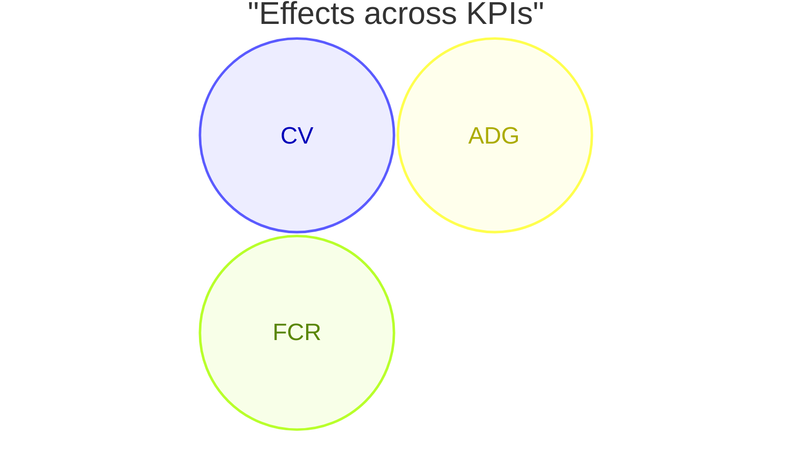

# jupyterlab_mermaid_latest_extension

[](https://github.com/stellarshenson/jupyterlab_mermaid_latest_extension/actions/workflows/build.yml)
[](https://www.npmjs.com/package/jupyterlab_mermaid_latest_extension)
[](https://pypi.org/project/jupyterlab_mermaid_latest_extension/)
[](https://pepy.tech/project/jupyterlab_mermaid_latest_extension)
[](https://jupyterlab.readthedocs.io/en/stable/)
[](https://kolomolo.com)
[](https://www.paypal.com/donate/?hosted_button_id=B4KPBJDLLXTSA)

> [!TIP]
> This extension is part of the [stellars_jupyterlab_extensions](https://github.com/stellarshenson/stellars_jupyterlab_extensions) metapackage. Install all Stellars extensions at once: `pip install stellars_jupyterlab_extensions`

JupyterLab extension that brings the latest version of the Mermaid diagram library to notebook and markdown rendering. JupyterLab ships with an older bundled Mermaid version - this extension replaces it with the current release so you get access to the newest diagram types, syntax features, and bug fixes.

> [!WARNING]
> This extension works by monkey-patching the built-in `IMermaidManager` at runtime. It replaces the manager's rendering methods with implementations that use a newer bundled Mermaid library. The built-in Mermaid extension remains loaded but its rendering code is bypassed. This approach may break if JupyterLab changes the `IMermaidManager` interface in a future major release.

## Features

- **Latest Mermaid version** - renders diagrams with Mermaid 11.15.0, independent of JupyterLab 4.5's bundled 11.12.3
- **New diagram types** - access beta and recently stabilised Mermaid diagrams (e.g., `venn-beta`) that the bundled version rejects with `UnknownDiagramError`
- **Transparent replacement** - notebooks, markdown cells, and `.md` files all render through the patched manager
- **Theme aware** - respects JupyterLab dark/light theme and re-renders on theme change

## How It Works

JupyterLab 4 provides an `IMermaidManager` token that all Mermaid rendering flows through. This extension requires that token, then replaces `getMermaid()`, `renderSvg()`, `renderFigure()`, and `getCachedFigure()` with its own implementations backed by a force-bundled newer Mermaid library. Since all consumers (notebook renderer, markdown renderer) hold references to the same manager object, they automatically use the patched methods. The built-in `@jupyterlab/mermaid-extension` stays loaded and enabled - its rendering code is simply bypassed.

## Example

A `venn-beta` diagram, unsupported by JupyterLab's bundled Mermaid, renders with this extension installed:

````markdown

````

## Installation

Requires JupyterLab 4.0.0 or higher.

```bash
pip install jupyterlab_mermaid_latest_extension
```

## Uninstall

```bash
pip uninstall jupyterlab_mermaid_latest_extension
```
